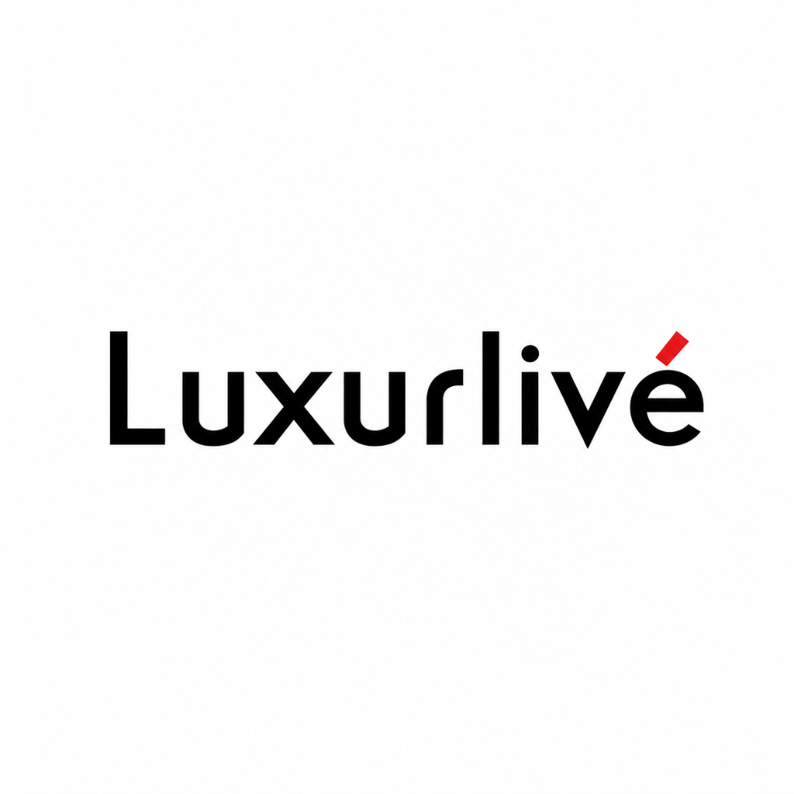

# LuxurLive - Modular  Kitchen & Wardrobes



**LuxurLive** is a high-end, premium web application built for a bespoke modular kitchen and luxury wardrobe manufacturing brand based in Kozhikode. The platform is designed with a heavy emphasis on luxury aesthetics, high-performance animations, and rigorous SEO optimization to rank highly for bespoke cabinetry and architectural storage solutions.

🌐 **Live Domain:** [luxurelive.com](https://luxurelive.com)

---

## 💎 Key Features

- **Luxury UI/UX Design:** A dark, minimalist, and deeply immersive user interface that reflects the bespoke and premium nature of the brand.
- **Cinematic Parallax Scrolling:** Custom CSS-driven fixed-attachment parallax sections that provide a rich, dimensional browsing experience without javascript overhead.
- **Bento Grid Architecture:** Clean, highly responsive asymmetric grid layouts tailored to showcase high-fidelity architectural details.
- **Advanced SEO Integration:** Built-in dynamic metadata management using `react-helmet-async`. Every page and image is heavily saturated with targeted keywords designed to capture the high-end cabinetry market in Kozhikode.
- **Performance Optimized:** All media assets are compressed JPEGs utilizing `loading="lazy"` and `decoding="async"` to guarantee lightning-fast Largest Contentful Paint (LCP) times.
- **Fluid Micro-Interactions:** A custom overarching cursor, smooth scroll reveals via Intersection Observers, and elegant hover states.

---

## 🛠️ Tech Stack

- **Core:** [React 18](https://reactjs.org/) + [Vite](https://vitejs.dev/)
- **Routing:** [React Router DOM v6](https://reactrouter.com/)
- **SEO Management:** [React Helmet Async](https://github.com/staylor/react-helmet-async)
- **Styling:** Vanilla CSS3 (Custom Design System, Flexbox, CSS Grid)
- **Icons/Lucide:** [Lucide React](https://lucide.dev/)

---

## 🚀 Getting Started

To run this project locally, follow these steps:

### Prerequisites
Make sure you have [Node.js](https://nodejs.org/) installed on your machine.

### Installation

1. **Clone the repository**
   ```bash
   git clone https://github.com/your-username/luxurlives.git
   cd luxurlives
   ```

2. **Install dependencies**
   ```bash
   npm install
   ```

3. **Start the development server**
   ```bash
   npm run dev
   ```

4. **Build for production**
   ```bash
   npm run build
   ```

---

## 📁 Project Structure

```text
src/
├── components/          # Reusable UI components (Navbar, Footer, CustomCursor)
├── pages/               # Route-level components (Home, About, Services, etc.)
├── App.jsx              # Main application router and layout wrapper
└── index.css            # Global design system, typography, and utility classes
public/                  # Static assets (images, logos, brochures, robots.txt)
```

---

## 🎨 Design Philosophy
The application deliberately avoids generic frameworks in favor of a strictly custom CSS architecture. This allows for absolute precision over spacing, typography (`Playfair Display`, `Inter`), and complex background gradient overlays, ensuring the digital experience is as bespoke as the physical wardrobes and kitchens the company manufactures.

---

*Designed and developed for LuxurLive.*
